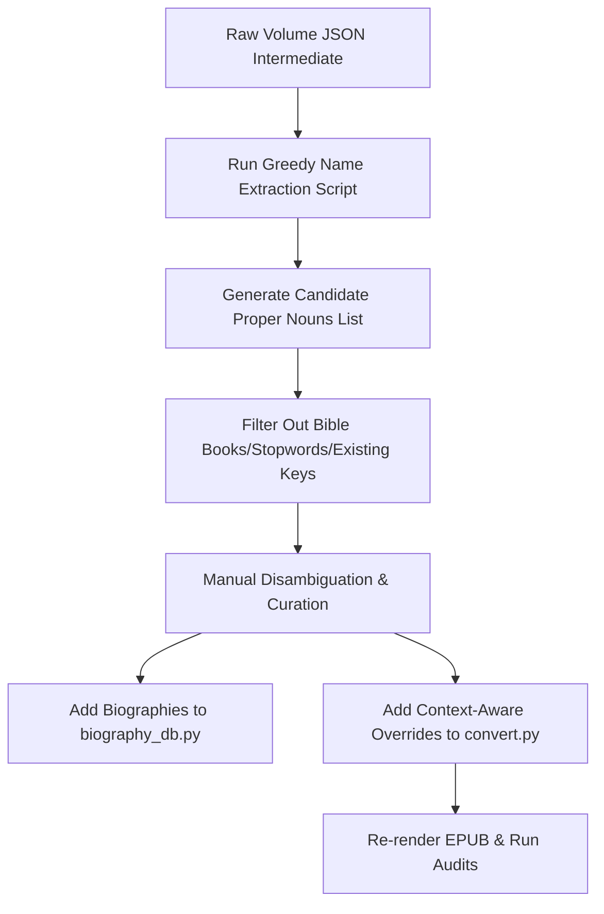

# Biographical Database Expansion Plan (All Volumes & Volume 12 Focus)

## 0. Volume Completion Status Checklist
- [x] Volume 1 (Pilot complete)
- [x] Volume 12 (Pilot complete)
- [x] Volume 2 (Complete)
- [x] Volume 5 (Complete)
- [ ] Volume 3 (Pending)
- [ ] Volume 4 (Pending)
- [ ] Volume 6 (Pending)
- [ ] Volume 7 (Pending)
- [ ] Volume 8 (Pending)
- [ ] Volume 9 (Pending)
- [ ] Volume 10 (Pending)
- [ ] Volume 11 (Pending)
- [ ] Volume 13 (Pending)
- [ ] Volume 14 (Pending)
- [ ] Volume 15 (Pending)
- [ ] Volume 16 (Pending)

---

This plan outlines a systematic, volume-by-volume strategy to build a greedy and thorough biographical database across the entire 16-volume John Owen collection. It places specific emphasis on **Volume 12** and details strict engineering guidelines to eliminate false-positive matches and resolve name mix-ups.

---

## 1. Technical Framework & Core Rules

To prevent historical name mix-ups, false positives on common words (e.g., "prosper", "more"), and duplicate replacements, the pipeline must adhere to the following rules:

### A. Case-Sensitive Matching (Strict)
All biographical terms in the scanner must be matched case-sensitively (removing `re.I` from biography compilation in [render.py](file:///Users/eddyekofo/Documents/Theology/epub_conversion/books/Owen/render.py) and [epub_pages.py](file:///Users/eddyekofo/Documents/Theology/epub_conversion/books/Owen/scripts/epub_pages.py)). This ensures common lowercase words (like the verb `prosper` or adjective `martial`) do not trigger biographical links.

### B. Full-Name Key Mapping (No Short/Generic Keys)
To prevent incorrect linkages on common names:
- **Rule**: Never use a single generic first name or surname as a key in [biography_db.py](file:///Users/eddyekofo/Documents/Theology/epub_conversion/books/Owen/scripts/biography_db.py) if it is shared by multiple figures or is a common biblical name.
- **Example**: Do not use `"Isaac"` (which matches Isaac Watts, Isaac Chauncy, or biblical Isaac). Instead, use distinct keys: `"Johannes Isaac"`, `"Isaac Watts"`, and `"Isaac Chauncy"`.

### C. Contextual Disambiguation via Per-Volume Overrides
When the text refers to a figure simply by a first name or surname (e.g., "Cyril" or "Goodwin"), we must resolve the ambiguity at the volume level:
1. Identify the correct figure based on context (e.g., Cyril of Alexandria vs. Cyril of Jerusalem; Thomas Goodwin vs. John Goodwin).
2. Expand the name in the volume's custom overrides [convert.py](file:///Users/eddyekofo/Documents/Theology/epub_conversion/books/Owen/volumes/v1/convert.py) `text_replacements`:
   - *Example (Volume 1)*: `'Cyril of Alexandria'` $\rightarrow$ key is matched directly. If the text says `'Cyril'`, replace `'Cyril, a man learned': 'Cyril of Alexandria, a man learned'`.
   - *Example (Volume 1)*: `'Sherlock (1690)'` $\rightarrow$ `'William Sherlock (1690)'`.
3. The biography scanner will then cleanly match the expanded full name without false positives.

### D. Idempotency of Text Replacements
All text replacements added to `convert.py` must be written to be *idempotent* to prevent double-replacement bugs when processed multiple times (during Stage 1 and Stage 2):
- **Rule**: Ensure the search target string is not a substring of the replaced text, or include surrounding contextual words in the target string.
- **Example of Bug**: `'Sherlock (1690)': 'William Sherlock (1690)'` $\rightarrow$ results in `"William William Sherlock"` on double-processing.
- **Correct Idempotent Replacement**: `'Bull (1686), Sherlock (1690), and South (1695)': 'George Bull (1686), William Sherlock (1690), and Robert South (1695)'`.

---

## 2. Implementation Pipeline

---

## 3. Phased Rollout Schedule

### Phase 1: Disambiguation Framework & Volume 12 Pilot (Immediate)
*   **Objective**: Target Volume 12 (*Vindiciae Evangelicae* and *The Priesthood of Christ*).
*   **Why Volume 12?**: This volume contains Owen's extensive refutation of Socinianism. It is densely packed with minor Polish, German, and Italian Socinian writers (e.g., Valentin Smalcius, Hieronymus Moskorzowski, Johannes Crellius, Jonasz Szlichtyng, Faustus Socinus) and numerous patristic names.
*   **Deliverables**:
    1. Run extraction scripts on Volume 12 JSON.
    2. Review and compile a dictionary of all Socinian, Roman Catholic, and Reformed theologians cited.
    3. Generate the Volume 12 `convert.py` overrides and update [biography_db.py](file:///Users/eddyekofo/Documents/Theology/epub_conversion/books/Owen/scripts/biography_db.py).

### Phase 2: Systematic Volume Scans (Vols 2–11, 13–16)
*   **Objective**: Perform batch proper-noun scans on the remaining volumes.
*   **Focus Areas**:
    - **Volume 2**: Trinity controversy and communion.
    - **Volume 3**: *Pneumatologia* (patristic writers on the Holy Spirit).
    - **Volume 5 & 10**: Justification and Arminian controversies.
    - **Volume 16**: Purity of Hebrew/Greek text (contains many Semitic and biblical scholars like Louis Cappel, Jean Morin, Arias Montanus).

### Phase 3: Validation and Regression Audit
*   **Objective**: Verify the integrity of the expanded database.
*   **Deliverables**:
    - Ensure zero duplicate name injections.
    - Run `pytest tests/test_bug_regressions.py` to assert that no formatting errors or nested links are introduced.

---

## 4. Sample Disambiguation Index

The following table provides the standard resolution mapping for names frequently shared or mixed up in John Owen's writings:

| Short/Common Form | Target Disambiguation Figure | Unique Key in `biography_db.py` |
| :--- | :--- | :--- |
| **Cyril** | Cyril of Alexandria (usually in Christological contexts) | `"Cyril"` (or `"Cyril of Alexandria"`) |
| **Cyril** | Cyril of Jerusalem (usually in catechetical/sacramental contexts) | `"Cyril of Jerusalem"` |
| **Goodwin** | Thomas Goodwin (Independent minister, Owen's associate) | `"Thomas Goodwin"` |
| **Goodwin** | John Goodwin (Arminian minister, Owen's opponent) | `"John Goodwin"` |
| **Isaac** | Johannes Isaac (16th-century Hebrew grammarian) | `"Johannes Isaac"` |
| **Isaac** | Isaac Watts (Hymn writer who succeeded to Owen's pulpit) | `"Isaac Watts"` |
| **Isaac** | Isaac Chauncy (Owen's immediate successor at Mark Lane) | `"Isaac Chauncy"` |
| **Gregory** | Gregory of Nazianzus (Doctor of the Church, Trinitarian) | `"Gregory of Nazianzus"` |
| **Gregory** | Gregory of Nyssa (Eastern church father) | `"Gregory of Nyssa"` |
| **Gregory** | Gregory the Great (Pope Gregory I, medieval theology) | `"Gregory the Great"` |
| **Justin** | Justin Martyr (2nd-century apologist) | `"Justin Martyr"` |
| **Justin** | Justin (3rd-century Roman historian) | `"Justin"` |
| **Biddle** | John Biddle (Father of English Unitarianism) | `"Biddle"` (or `"John Biddle"`) |
